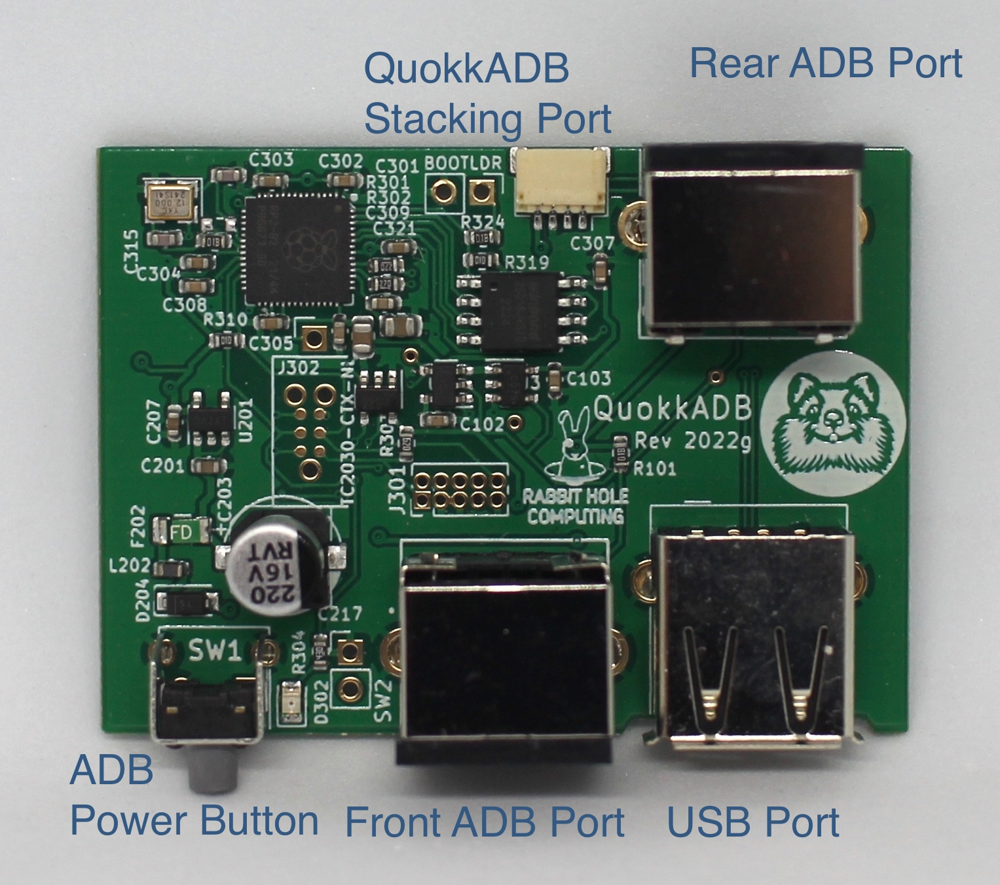
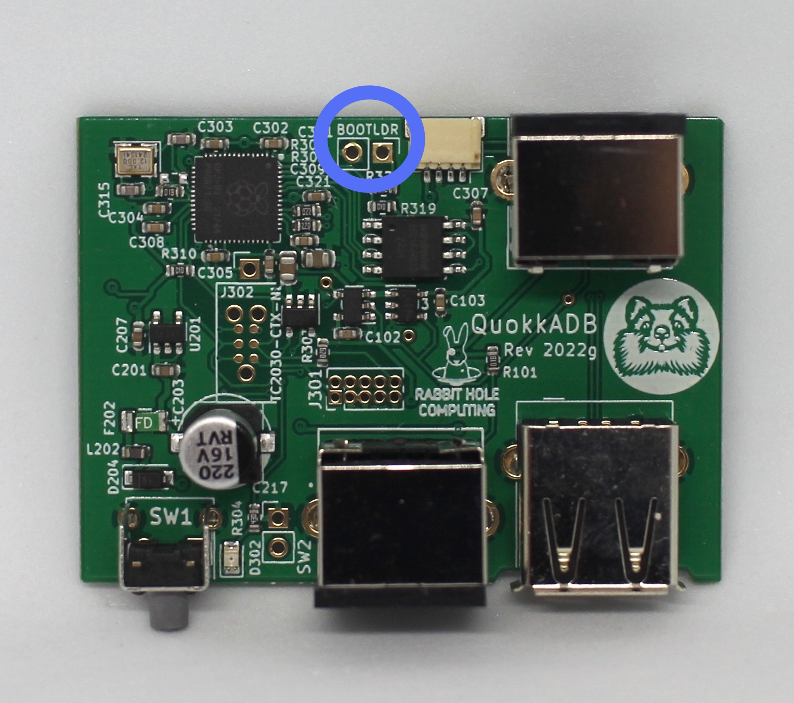

# QuokkADB
A USB keyboard and mouse to ADB (Apple Desktop Bus) keyboard and mouse emulator.
The firmware is based upon the ADBuino and is kept in-sync with the upstream repository at [https://github.com/akuker/adbuino](https://github.com/akuker/adbuino).

## How to use
1. Attach any USB keyboards/mice to your QuokkADB.
2. Before powering on your Macintosh, make sure the QuokkADB is plugged into the ADB chain and
the ADB chain is connected to the host computer. The host computer writes settings to the QuokkADB at boot and does not rewrite settings on reconnect. *DO NOT* unplug the QuokkADB from the ADB chain while the computer is on, as the QuokkADB will lose its settings).
4. The button on the QuokkADB will turn on any ADB-equipped Macintosh which supports soft power-on. Otherwise, you must use the power switch on the computer.
5. Once the power is turned on LEDs on the QuokkADB will blink once for power and then blink for all devices found on the USB bus.
6. The QuokkADB LED should blink rapidly and brightly whenever the QuokkADB is reading or writing to the ADB bus. It should be very dim otherwise.

## The board
### Ports
 - USB port: plug in your keyboard, mouse, or hub here.
 - Front and Back ADB ports: either port can be directly hooked up to the host computer or connected to a ADB chain. One port should be connected towards the host while the other may be connected to other ADB devices.
 - QuokkADB stack port: This port uses a 4 pin JST to JST wire to stack two QuokkADBs together giving two USB ports. The four-pin [Qwiic](https://www.sparkfun.com/categories/tags/qwiic-cables) JST cable can be used to connect two QuokkADBs together.
The stack port carries all four ADB signals.
    - pin 1 ADB
    - pin 2 Power Switch
    - pin 3 GND
    - pin 4 +5V ADB power

## Special Key-combos
The special keyboad commands start with `CTRL + SHIFT + CAPS LOCK` and a letter key.  Example: `CTRL + SHIFT + CAPS LOCK + V` ghost types the firmware version.
 - `P` - Ghost types the current settings and a list of the special keys
 - `V` - Ghost types firmware version
 - `L` - Led status toggle on/off . This controls whether the LED blinks when accessing the ADB bus or remains off for light sensitive situations.
 - `+` - Increases the sensitivity of the mouse - blinks the new divisor setting 
 - `-` - Decreases the sensitivity of the mouse - blinks the new divisor setting
 - `S` - Saves the current settings to flash so they stick on future power ups
 - `R` - Restore factory settings and clear the settings in flash

## Mouse Sensitivity
The mouse sensitivity is controlled by dividing the USB mouse's reported movement by the `sensitivity divisor`. This currently has a range of 1-16. The smaller this number the 
more sensitive the mouse feels over the ADB port (the further the cursor will move across the screen).

Using the special key-combos +/- changes this number. Hitting
the `+` key-combo increases the sensitivity of the mouse, thus decreasing the divisor. The divisor value is printed out when 
the special key-combo `P` is pressed. And the save action stores this value in flash so you don't have to change it between
power ups.

## Flashing firmware updates 
The firmware version can be found by opening up an empty text document or program that allows typing. 
Press `Ctrl + Shift + CapsLock + V` and the firmware version will be ghost typed.
To change the firmware do the following:
1. Disconnect the ADB ports, and the QuokkADB stack port on the QuokkADB
2. Short the two boot loader contacts labeled "BOOTLDR" using a metal object such as a paperclip, tweezers, or a jumpered two-pin header strip.

3. Connect a USB A to USB A cable to the QuokkADB USB port and
the computer with the `.uf2` file on it. Firmware can be downloaded from [here](https://github.com/rabbitholecomputing/QuokkADB-firmware/releases).
1. Once connected a mass storage device drive should be mounted on the computer (at this point the boot loader contacts can be 
disconnected).  
1. Copy the `.uf2` to the new drive
2. Once the file has finished copying one of two things should happen
     1. If the boot loader is still shorted, the mass storage device drive will mount again but without the firmware file on the drive. 
     2. If the boot loader is not shorted anymore, the QuokkADB will blink once then remain very dim.

     In either case the new firmware is installed and once the
     boot loader contacts are no longer shorted the board is ready to use.

## Current Status
 - Caps Lock with keyboard LED caps lock indicator working
 - Normal Apple mouse emulation working
 - Extended Apple US keyboard emulation working - left and right modifier keys when the OS switches keyboard type
 - Logitech Unifying receiver works
 - Scroll Lock, Pause/Break as F14, and F15 respectively 
 - Rear facing and front facing ADB can be connected to host (Mac)
 or used to connected to another ADB device
 - Mouse and keyboard readdressing implemented so multiple QuokkADBs, other ADB keyboards, and/or mice can be used 
 - Multiple USB keyboards or mice can be attached and will work.

## Parity with USB Wombat
 - Context menu for Mac OS 8.1 and above - middle mouse button switches right click mode
   - default: mouse right clicks are sent as Ctrl+click
   - other:  right click is sent over the ADB bus as a right click (should work on NeXTstations)
 - SysRq/Print Screen and F13 work as the Apple Power key (keycode 0x7F, separate from ADB power on button on the QuokkADB)
 - Ctrl + Shift + CapsLock + V - ghost types the firmware version to the host computer
 - power button on QuokkADB will turn on computer while QuokkADB is powered off, if machine supports soft power-on
  
## QuokkADB LED blink meanings
 - On boot - one blink
 - On second core and USB host driver loaded - one blink
 - On keyboard mount (connected to usb) - two blinks
 - On mouse mount (connected to usb)- three blinks
 - On device unmount (disconnected to usb) - one blink
 - Saving to settings to flash - four blinks
 - Clearing flash and loading defaults - five blinks
 - On sensitivity change - blinks the current sensitivity divisor (1-16)
 - Normal operation - very dim light when idle, blinks when there is activity on the ADB bus for the device.

### Normal LED sequence:
If both a mouse and keyboard are connected to the QuokkADB:

Turning on the Mac:
 1. One blink - power on
 2. One blink - second core and USB up and running
 2. Two blinks - keyboard initialized
 3. Three blinks - mouse initialized

Removing mouse:
 1. One blink

Inserting a new mouse:
 1. Three blinks

## Known Bugs
 - Repeatedly pressing buttons that toggle LED states, such as caps lock, num lock, and scroll lock results in the LEDs no longer changing state, after many LED toggles. The keyboard functions normally and functions like caps lock still works, but the LED status indicators no longer change.
 - Some USB hubs do not seem to work.

## Compiling
This is a PlatformIO project
Download the PlatformIO CLI or install the extension in VSCode

### With the CLI
From the root directory of the project
1) `cd src/firmware`
2) Run `pio run -e quokkadb`

### With VSCode
Open the directory `src/firmware` from the project root directory with VSCode 
1) Select the environment `quokkadb`
2)  Click Build under the PlatformIO panel

In either case the uf2 file should be in the directory `src/firmware/.pio/quokkadb/build`
