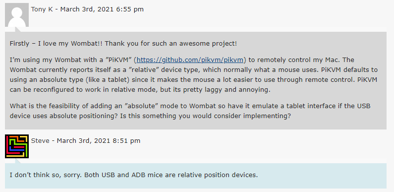

# Background

This is a fork of Difegue's version of the [adbuino](https://github.com/Difegue/Chaotic-Realm), which was a modified version of [bbraun's](http://synack.net/svn/adbduino/) PS/2 to ADB arduino sketch, with some extra code added to alleviate issues with his own PS/2 keyboard.  For Difegue's original write-up, please read more info [here.](https://tvc-16.science/adbuino-ps2.html).

# What's this repo for?

The intent of this repository is to add "USB Host" support to the design. This will allow a USB keyboard and/or mouse to be used to drive an ADB host, as well as PS/2. 

The long term goal is to add "absolute" positioning capability to allow this to integrate better with the [pikvm](https://github.com/pikvm/pikvm) project for controlling vintage Macintosh computers. Currently, the [BMOW "Wombat"](https://www.bigmessowires.com/usb-wombat/) works to connect a Mac to a PiKVM. However, the Wombat only supports relative cursor positioning. This makes the user experience less than desireable. 

> 

I'm a stubborn SOB, so I'm hoping to prove him wrong. :) Since Wombat is closed source, I'm starting off with Difegue's / BBraun's project as a starting point.

Note: The [BMOW "Wombat"](https://www.bigmessowires.com/usb-wombat/) is an AWESOME project. It works fantastic for everything except interfacing with a PiKVM. I highly recommend picking one up!

# References

https://www.raspberrypi-spy.co.uk/2021/01/pi-pico-pinout-and-power-pins/

[TinyUSB Library](https://github.com/raspberrypi/tinyusb)

[Running OpenOCD without root](https://forgge.github.io/theCore/guides/running-openocd-without-sudo.html)

[Apple ADB Manager Documenation](https://developer.apple.com/library/archive/documentation/mac/pdf/Devices/ADB_Manager.pdf)

https://www.mouser.com/ProductDetail/TE-Connectivity/5749181-1?qs=XlZqES4cpWbRcAMR%2FcJqkQ%3D%3D
